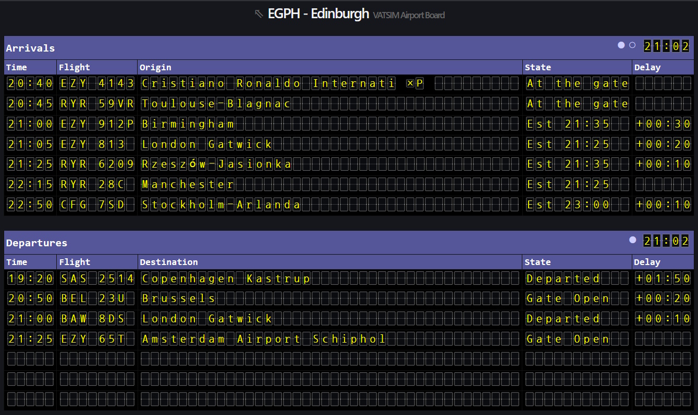

# ✈️ VATSIM Airport Board

[](https://vatsim-airport-board-dusky.vercel.app/#/airport/BIIS) [](LICENSE)



VATSIM Airport Board is a simple flight board web app that shows arrivals and departures for a selected airport. It’s designed to run locally or be deployed as a small public page — the focus is on a clear flight display, easy paging, and configurable data sources.

## 🎯 Who it's for

- Virtual airport operators who want a lightweight, easy-to-read board showing current flights.
- Streamers or traffic observers who want a compact display for a second screen or an overlay.

## ✨ What it does (quick overview)

- Displays two separate boards: Arrivals and Departures.
- Supports paged rows with automatic page rotation.
- Each board has its own rotation schedule — you can set the duration for the first page and a separate interval for other pages.
- Options to show remote departures and to change the number of rows per page.

## 🔗 Live App

A live app is available at: https://vatsim-airport-board-dusky.vercel.app

## 🛠️ Run locally

Get started quickly:

```bash
npm install
npm run dev
# open http://localhost:5173
```

Build for production and preview locally:

```bash
npm run build
npm run preview
```

## ▶️ Example of usage

### ▶️ How to use the app

- From the home screen select an airport (by ICAO) from the list.
- On the board page you can change settings in the bottom control panel: number of rows, enable/disable page rotation, set the duration for the first page and for other pages, and toggle remote departures.
- Settings are stored in `localStorage` per ICAO.

### 📦 Where the data comes from

- Airports list: `public/data/airports.csv` — loaded at startup and used to map ICAO codes to airport names/timezones.
- Optional live data: VATSIM v3 feed. A loader is prepared in `src/services/vatsimService.ts`.

## 🤝 Contributing

- Found a bug or want a feature? Open an issue or submit a pull request with a description of the change.

## 🧰 Tech notes (for developers)

- The app is built with React + TypeScript and uses Vite for bundling. Main UI lives in `src/pages/AirportBoard` and data loaders are under `src/services`.

## 📝 License

This project is licensed under the MIT License — see the `LICENSE` file for details.

## 🙏 Acknowledgements

We use the free airport database from http://ourairports.com. Thank you to the project maintainers for providing this data.

We use the `react-ticker-board` package for improved visuals and smooth tickers — thanks to the maintainers for their work.
